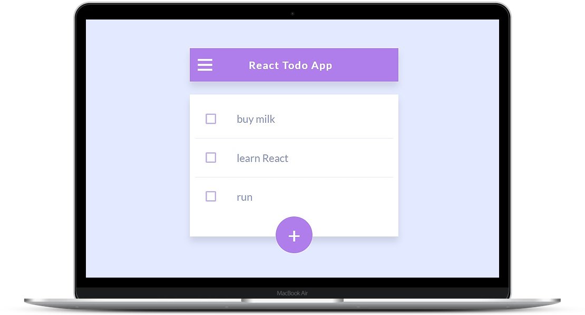

# React Todo

---

### Table of Contents

- [Description](#description)
- [How To Use](#how-to-use)
- [References](#references)
- [License](#license)
- [Author Info](#author-info)

---

## Description

 Project that i made to practice React.A simple Todo App that use Local Storage to save your todos..U can add,delete,check and uncheck todos.

#### Technologies
- React
- Sass (SCSS)

[Back To The Top](#read-me-template)

---

## How To Use

#### Installation

- npm install

#### To run local dev-server

- npm run dev-server

  

[Back To The Top](#read-me-template)

---

## References

- Design credits go to Adrien on [Dribbble](https://dribbble.com/adriengervaix)

  
[Back To The Top](#read-me-template)

---

## License

MIT License

Copyright (c) [2018] [Vladimir Blagojevic]

[Back To The Top](#read-me-template)

---

## Author Info

- Twitter - [@Vladimir B.](https://twitter.com/Kvout90)
- Website - [Vladimir B.](https://github.com/VladimirBlagojevic)

[Back To The Top](#read-me-template)